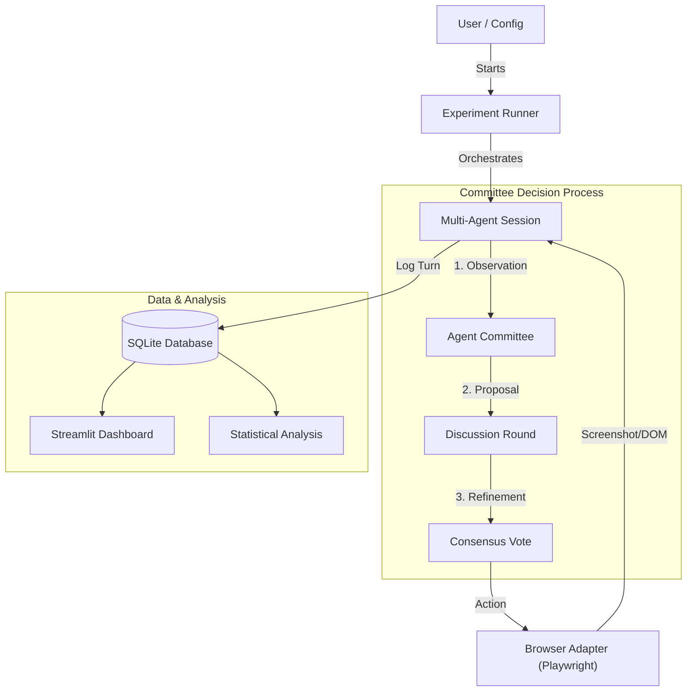

# Multi-Agent Vision Beta Testing Framework

> **NYU IDLS Course Project** - Automated beta testing using multiple LLaVA vision agents with committee-based decision making.

## Overview

This framework utilizes **multi-agent LLM committees** with **vision capabilities** (LLaVA, GPT-4o, Gemini, Claude) to test web applications through visible browser automation. Unlike single-agent testers, this system uses a "committee of agents" that analyze screenshots, discuss proposals, and reach consensus on actions. This approach significantly reduces hallucinations and improves bug detection coverage.

The project has been expanded into a comprehensive **Research Framework** designed to validate hypotheses about multi-agent collaboration, persona diversity, and vision-enabled testing.

## Key Features

- **Multi-Agent Committee**: 3-round voting protocol (Proposal → Discussion → Consensus).
- **Vision-Based Testing**: Agents "see" the UI via screenshots, enabling testing of visual elements.
- **Experimental Infrastructure**: Automated runner for large-scale experiments (e.g., N=60 runs).
- **Metric Collection**: SQLite database tracking 15+ metrics (consensus rates, latency, bug detection).
- **Persona-Driven**: Configurable personas (e.g., "Adversarial Attacker", "UX Researcher") to find specific bug types.
- **Security Testing**: Integrated OWASP checks (SQLi, XSS) and regression testing.
- **Interactive Dashboard**: Streamlit UI for analyzing agent discussions and results.

## Architecture



## Quick Start (Single Session)

### 1. Install Dependencies

```bash
pip install -r requirements.txt
playwright install chromium
```

### 2. Setup LLM Provider (Ollama / OpenAI / Google)

```bash
# For local LLaVA:
brew install ollama
ollama serve
ollama pull llava
```

### 3. Start Application Under Test (AUT)

```bash
# Start the demo e-commerce app
uvicorn aut_service:app --port 8000
```

### 4. Run a Test Session

```bash
# Run with default settings (4 agents, online_shopper)
python main.py

# Customize the session
python main.py --persona personas/adversarial_attacker.yaml --agents 2
```

### 5. View Results

```bash
streamlit run dashboard_app.py
```

## Experimental Infrastructure

This project includes a robust infrastructure for running controlled experiments, located in the `experiments/` directory.

### Core Components
- **`experiments/runner.py`**: Orchestrates batch runs based on YAML configurations. Handles seeding, checkpointing, and parallel execution.
- **`experiments/metrics_collector.py`**: Calculates comprehensive metrics for each run, including task success, safety violations, and inter-agent agreement (Fleiss' kappa).
- **`experiments/bug_injector.py`**: Manages ground-truth bugs to measure detection rates.
- **`experiments/schema.sql`**: SQLite schema for storing granular run data.

### Running Experiments

To run a full experiment (e.g., verifying multi-agent scaling):

```bash
# Run the scaling experiment (Experiment 1A)
python experiments/runner.py --config experiments/configs/experiment_1a_scaling.yaml
```

## Research Experiments

We are conducting several key experiments to validate the framework:

| Exp | Name | Hypothesis |
|-----|------|------------|
| **1A** | **Multi-Agent Scaling** | Larger committees (up to 4) achieve higher bug detection rates due to error correction. |
| **1B** | **Persona Diversity** | Distinct personas (Attacker vs. Shopper) find disjoint sets of bugs. |
| **1C** | **Vision Impact** | Vision-enabled models outperform text-only DOM parsers on UI-heavy tasks. |
| **1D** | **Regression Detection** | Multi-agent committees are more reliable at catching regressions across versions. |
| **2** | **OWASP Security** | The framework can autonomously detect OWASP Top 10 vulnerabilities (SQLi, XSS). |

## Project Structure

```text
LLM_Agents_For_Beta_Testing/
├── app/                        # Core Application Logic
│   ├── multi_agent_runner.py   # Session orchestrator
│   ├── multi_agent_committee.py # Voting protocol implementation
│   ├── browser_adapter.py      # Playwright automation
│   ├── agent.py                # LLM agent wrapper
│   └── storage.py              # CSV/File logging
├── experiments/                # Research Infrastructure
│   ├── runner.py               # Batch experiment runner
│   ├── metrics_collector.py    # Statistical metrics
│   ├── bug_injector.py         # Ground truth management
│   └── configs/                # Experiment YAML configs
├── personas/                   # Agent Personas (.yaml)
│   ├── online_shopper.yaml
│   ├── adversarial_attacker.yaml
│   └── ...
├── scenarios/                  # Test Scenarios (.yaml)
│   ├── ui_shopping_flow.yaml
│   └── ...
├── results/                    # Output Directory
│   ├── runs.db                 # SQLite database of comprehensive results
│   └── {session_id}/           # Individual session artifacts (screenshots)
├── paper/                      # NeurIPS Paper Assets
├── aut_service.py              # Application Under Test (FastAPI)
├── main.py                     # CLI Entry Point
└── dashboard_app.py            # Streamlit Visualization
```

## Configuration

### Model Configuration (`config/model_config.yaml`)
Define your LLM providers here. We support **Ollama**, **OpenAI**, **Google Gemini**, **Anthropic**, and **xAI**.

```yaml
models:
  - name: gpt-4o
    provider: openai
  - name: llava
    provider: ollama
```

### Runtime Configuration (`config.py`)
Control global settings like `MAX_TURNS` and API locations.

## Data & Analysis

All experimental data is logged to `results/runs.db` (SQLite). You can export this data for analysis or visualize it using the dashboard.

**Key Metrics Tracked:**
- **Task Success Rate**: Percentage of scenarios completed.
- **Bug Detection Rate**: Percentage of injected bugs found.
- **Consensus Rate**: How often agents agree.
- **Safety Violations**: Attempts to perform dangerous actions.
- **Latency**: Time per turn.

## License

MIT License

## Authors

- **Dhiwahar Adhithya Kennady** (dk5025)
- **Sumanth Bharadwaj Hachalli Karanam** (sh8111)
